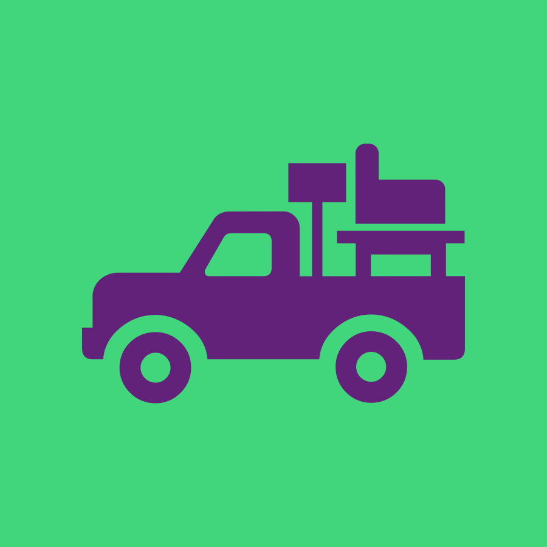

# Truck'd 

### Description

Truck'd is a service for connecting people who need to move with people who own a truck.

### v1 Features

### v2 Features

### Team

- Design Lead- UI [Shane Lupton](https://github.com/slupton89)
- Project Manager [Aaron Whitehead](https://github.com/WhiteheadAaron)
- QA Lead [Sean Phelan](https://github.com/phelan97)
- Product Manager [Colin Rupp](https://github.com/rupp-colin)
- UX and Marketing Lead [Alex Gutierrez](https://github.com/alexgutes)
